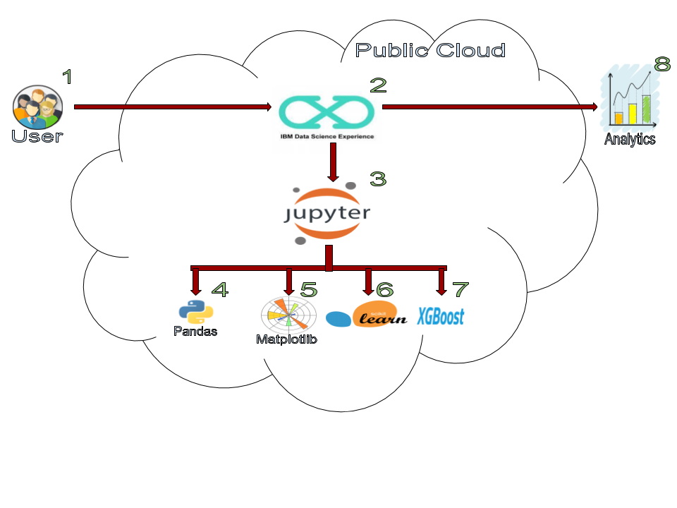
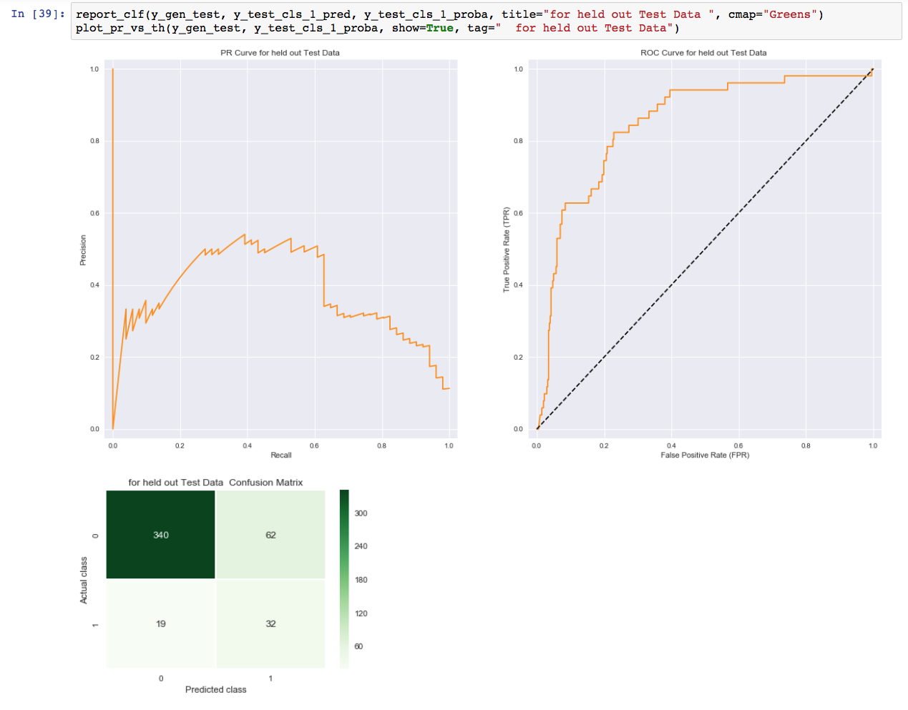
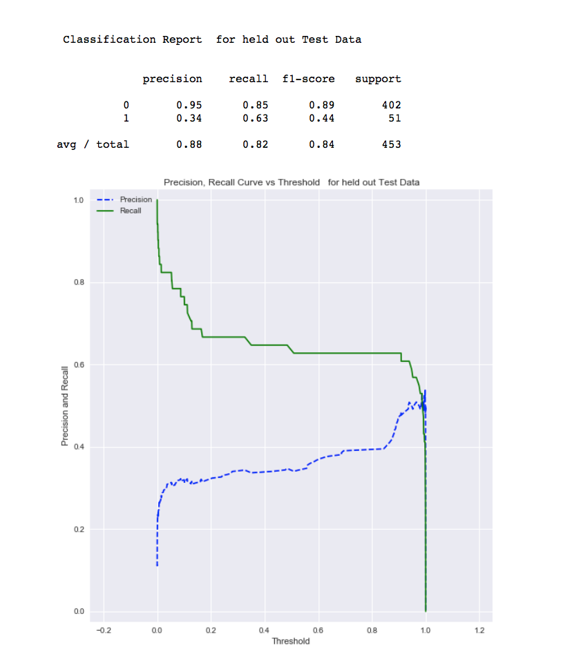

## Predicting Bank Client's Financial Product subscription using Scikit Learn and XGBoost for imbalance dataset

This Code Pattern will guide you through how to use `XGBoost`, `Scikit Learn` and `Python` in IBM Watson Studio to predict Bank Client's subscription to financial product based off a [UCI repository for Bank Marketing Data Set](http://archive.ics.uci.edu/ml/datasets/Bank+Marketing).

Class imbalance is a common problem in data science, where the number of positive samples are significantly less than the number of negative samples. As data scientists, one would like to solve this problem and create a classifier with good performance. XGBoost (Extreme Gradient Boosting Decision Tree) is very common tool for creating the Machine Learning Models for classification and regression. However, there are various tricks and techniques for creating good classification models using XGBoost for imbalanced data-sets that is non-trivial and the reason for developing this Code Pattern.

In this Code Pattern, we will illustrate how the Machine Learning classification is performed using XGBoost, which is usually a better choice compared to logistic regression and other techniques. We will use a real life data set which is highly imbalanced (i.e the number of positive sample is much less than the number of negative samples).

This Code Pattern will walk the user through the following conceptual steps:

* Data Set Description.
* Exploratory Analysis to understand the data.
* Use various preprocessing to clean and prepare the data.
* Use naive XGBoost to run the classification.
    * Use cross validation to get the model.
    * Plot, precision recall curve and ROC curve.
* We will then tune it and use weighted positive samples to improve classification performance.
* We will also talk about the following advanced techniques.
    * Oversampling of majority class and Undersampling of minority class.
    * SMOTE algorithms.



## Flow

1. Log into IBM Watson Studio service.
2. Upload the data as a data asset into Watson Studio.
3. Start a notebook in Watson Studio and input the data asset previously created.
4.
5.
6.
7.
8. Evaulate their predictive performance.

## Included components

* [IBM Watson Studio](https://dataplatform.ibm.com): Analyze data using RStudio, Jupyter, and Python in a configured, collaborative environment that includes IBM value-adds, such as managed Spark.
* [Jupyter Notebook](http://jupyter.org/): An open source web application that allows you to create and share documents that contain live code, equations, visualizations, and explanatory text.

## Featured technologies

* [Data Science](https://medium.com/ibm-data-science-experience/): Systems and scientific methods to analyze structured and unstructured data in order to extract knowledge and insights.
* [Python](https://www.python.org/): Python is a programming language that lets you work more quickly and integrate your systems more effectively.
* [XGBoost](https://github.com/dmlc/xgboost): Extreme Gradient Boosting is decision tree based tools for creating ML model.
* [Scikit Learn](http://scikit-learn.org/stable/):  A Python library for providing efficient tools for data mining and machine learning.
* [Pandas](http://pandas.pydata.org/): A Python library providing high-performance, easy-to-use data structures.
* [Matplotlib](https://matplotlib.org/): A Python library integrating matplot for visualization.
* [SeaBorn](https://seaborn.pydata.org/): Another higher level Python library for visualization.

# Steps

This Code Pattern consists of following activities:

* [Run a Jupyter notebook in the IBM Watson Studio](#run-a-jupyter-notebook-in-the-ibm-watson-studio).
* [Explore, Analyze and Predict CD Subscription for Bank Client](#explore-analyze-and-predict-cd-subscription-for-bank-client).

## Run a Jupyter notebook in the IBM Watson Studio

1. [Sign up for the Watson Studio](#1-sign-up-for-the-watson-studio)
2. [Create a new Watson Studio project](#2-create-a-new-watson-studio-project)
3. [Create the notebook](#3-create-the-notebook)
4. [Upload data](#4-upload-data)
5. [Run the notebook](#5-run-the-notebook)
6. [Save and Share](#6-save-and-share)

### 1. Sign up for the Watson Studio

Log in or sign up for IBM's [Watson Studio](https://dataplatform.ibm.com).

> Note: if you would prefer to skip the remaining Watson Studio set-up steps and just follow along by viewing the completed Notebook, simply:
> * View the completed [notebook](https://github.com/aloknsingh/ds_xgboost_clf_4_imbalance_data/tree/master/notebooks/predict_bank_cd_subs_by_xgboost_clf_for_imbalance_dataset.ipynb) and its outputs, as is.
> * While viewing the notebook, you can optionally download it to store for future use.
> * When complete, continue this code pattern by jumping ahead to the [Analyze and Predict the data](#analyze-and-predict-the-data) section.

### 2. Create a new Watson Studio project

* Select the `New Project` option from the Watson Studio landing page and choose the `Data Science` option.


* To create a project in Watson Studio, give the project a name and either create a new `Cloud Object Storage` service or select an existing one from your IBM Cloud account.


* Upon a successful project creation, you are taken to a dashboard view of your project. Take note of the `Assets` and `Settings` tabs, we'll be using them to associate our project with any external assets (datasets and notebooks) and any IBM cloud services.


### 3. Create the Notebook

* From the project dashboard view, click the `Assets` tab, click the `+ New notebook` button.


* Give your notebook a name and select your desired runtime, in this case we'll be using the associated Spark runtime.


* Now select the `From URL` tab to specify the URL to the notebook in this repository.


* Enter this URL:

```
https://github.com/aloknsingh/ds_xgboost_clf_4_imbalance_data/tree/master/notebooks/predict_bank_cd_subs_by_xgboost_clf_for_imbalance_dataset.ipynb
```

* Click the `Create` button.

### 4. Upload data

* Return to the project dashboard view and select the `Assets` tab.
* This project has 3 datasets. Upload all three as data assets in your project. Do this by loading each dataset into the pop up section on the right hand side. Please see a screenshot of what it should look like below.   
* Once complete, go into your notebook in the edit mode (click on the pencil icon next to your notebook on the dashboard). 
* Click on the ``1001`` data icon in the top right. The data files should show up. 
* Click on each and select ``Insert Pandas Data Frame``. Once you do that, a whole bunch of code will show up in your first cell. 
* Make sure your ``bank.csv`` is saved as ``data_raw_all` so that it is consistent with the original notebook. You may have to edit this because when your data is loaded into the notebook, it may be defined as a continuation of data frames, based on where I left off. This means your data may show up with ``bank.csv`` as ``df_data_2` and so on. Either adjust the data frame names to be in sync with mine (remove where I loaded data and rename your data frames or input your loading information into the original code) or edit the following code below accordingly. Do this to make sure the code will run!

### 5. Run the notebook

When a notebook is executed, what is actually happening is that each code cell in
the notebook is executed, in order, from top to bottom.

Each code cell is selectable and is preceded by a tag in the left margin. The tag
format is `In [x]:`. Depending on the state of the notebook, the `x` can be:

* A blank, this indicates that the cell has never been executed.
* A number, this number represents the relative order this code step was executed.
* A `*`, this indicates that the cell is currently executing.

There are several ways to execute the code cells in your notebook:

* One cell at a time.
  * Select the cell, and then press the `Play` button in the toolbar.
* Batch mode, in sequential order.
  * From the `Cell` menu bar, there are several options available. For example, you
    can `Run All` cells in your notebook, or you can `Run All Below`, that will
    start executing from the first cell under the currently selected cell, and then
    continue executing all cells that follow.
* At a scheduled time.
  * Press the `Schedule` button located in the top right section of your notebook
    panel. Here you can schedule your notebook to be executed once at some future
    time, or repeatedly at your specified interval.

### 6. Save and Share

#### How to save your work:

Under the `File` menu, there are several ways to save your notebook:

* `Save` will simply save the current state of your notebook, without any version
  information.
* `Save Version` will save your current state of your notebook with a version tag
  that contains a date and time stamp. Up to 10 versions of your notebook can be
  saved, each one retrievable by selecting the `Revert To Version` menu item.

#### How to share your work:

You can share your notebook by selecting the ``Share`` button located in the top
right section of your notebook panel. The end result of this action will be a URL
link that will display a “read-only” version of your notebook. You have several
options to specify exactly what you want shared from your notebook:

* `Only text and output`: will remove all code cells from the notebook view.
* `All content excluding sensitive code cells`:  will remove any code cells
  that contain a *sensitive* tag. For example, `# @hidden_cell` is used to protect
  your dashDB credentials from being shared.
* `All content, including code`: displays the notebook as is.
* A variety of `download as` options are also available in the menu.

## Explore, Analyze and Predict CD Subscription for Bank Client
 
### 1. Explore the dataset

The imbalanced dataset is from Purtugese Bank Marketing data, where bank's associate makes call to user to sell financial product i.e CD to bank's client.

### 2. Prepare the data

For this section we will mostly use Python based libraries such as XGBoost, Scikit-learn, Matplotlib, SeaBorn, and Pandas.

### 3. Visual Data Exploration to understand the data using Seaborn and Matplotlib

Data scientists typically perform data exploration to gain better insight into data. Here we will explore inputs for distribution, correlation and outliers, and outputs to note any class imbalance issues.

### 4. Create Scikit learn ML Pipelines for Data Processing
  
- Split the data into train and test sets.
- Create an ML pipeline for data preparation.

In typical machine learning applications, an ML pipeline is created so that all the steps that are done on a training data set can be easily applied to the test set.

### 5. Model Training and evaluation

Model Training is a iterative process and we will do several iterations to improve our model performance.

Using XGBoost as our tool of choice, we will highlight classification performance metrics such as ROC curve, Precision-Recall curve, and Confusion Matrix.

We then offer multiple strategies to improve our classifier performance.

## Sample Output

After running, weighted and feature selected classifier, we find the final result based on the classification report and various stats. This is summarized in the following two screen-shots:




Awesome job following along! Now go try and take this further or apply it to a different use case!

## Links

- Watson Studio: https://datascience.ibm.com/docs/content/analyze-data/creating-notebooks.html.
- Pandas: http://pandas.pydata.org/
- Data: http://archive.ics.uci.edu/ml/datasets/Bank+Marketing
- Scikit Learn: http://scikit-learn.org/stable/
- XGBoost: https://github.com/dmlc/xgboost
- Matplotlib: https://matplotlib.org/
- SeaBorn: https://seaborn.pydata.org

# Learn more

* **Data Analytics Code Patterns**: Enjoyed this Code Pattern? Check out our other [Data Analytics Code Patterns](https://developer.ibm.com/code/technologies/data-science/)
* **AI and Data Code Pattern Playlist**: Bookmark our [playlist](https://www.youtube.com/playlist?list=PLzUbsvIyrNfknNewObx5N7uGZ5FKH0Fde) with all of our Code Pattern videos
* **Data Science Experience**: Master the art of data science with IBM's [Data Science Experience](https://datascience.ibm.com/)
* **Spark on IBM Cloud**: Need a Spark cluster? Create up to 30 Spark executors on IBM Cloud with our [Spark service](https://console.bluemix.net/catalog/services/apache-spark)

# License

[Apache 2.0](LICENSE)
